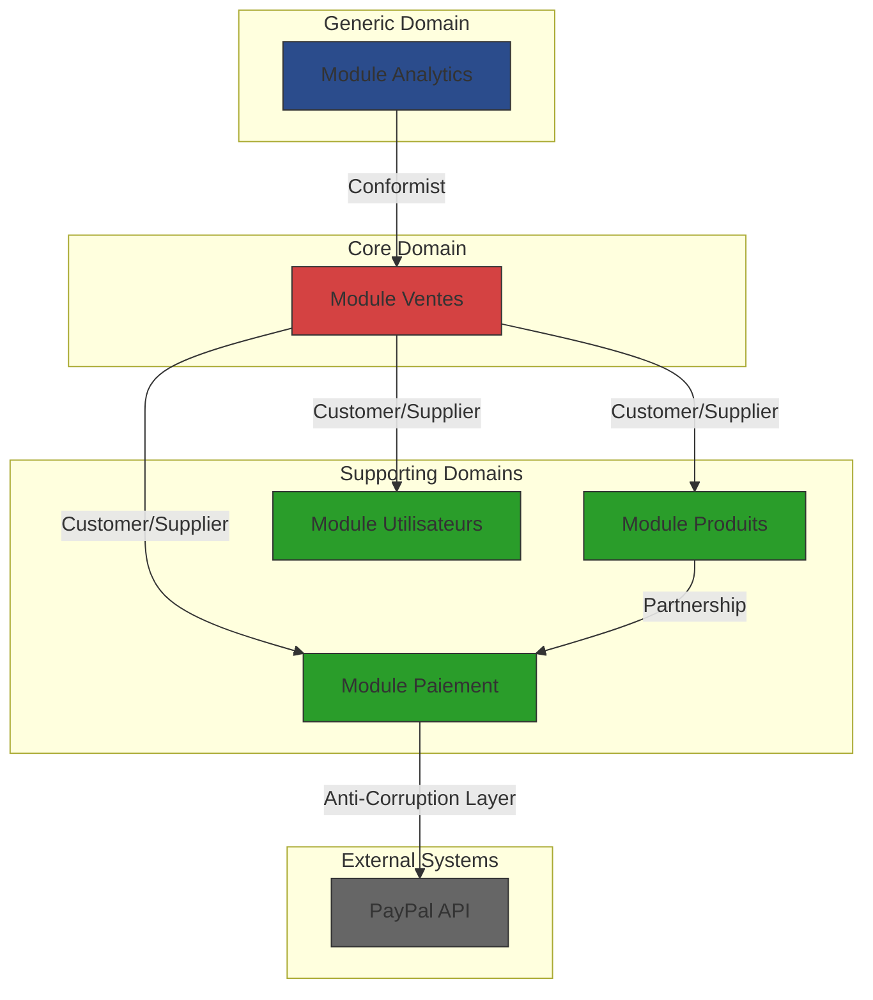
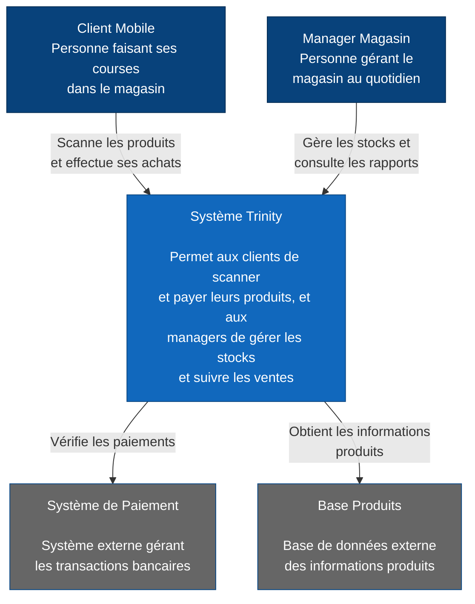
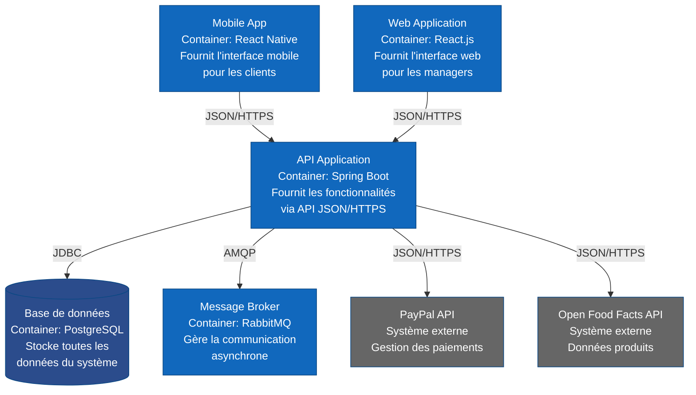
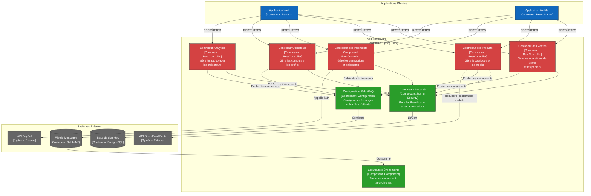

# Architecture Modulaire - Structure DDD

https://www.alexandrevandekerkhove.fr/2020/02/10/c4model-pour-les-diags-darchi.html
https://www.alexandrevandekerkhove.fr/2020/02/10/c4model-pour-les-diags-darchi.html
https://www.alexandrevandekerkhove.fr/2019/03/20/architecture-modulaire-microservices-on-en-est-ou.html
https://medium.com/nick-tune-tech-strategy-blog/domain-driven-architecture-diagrams-139a75acb578

## Analyse des domaines métiers (Bounded Contexts)

- **Gestion des Utilisateurs**
    - Responsabilités :
        - Gestion des comptes clients
        - Authentification et autorisation (JWT)
        - Gestion des informations personnelles et de facturation
- **Gestion des Produits**
    - Responsabilités :
        - Gestion du catalogue produits
        - Intégration avec Open Food Facts API
        - Gestion des stocks
        - Information nutritionnelle
- **Gestion des Ventes**
    - Responsabilités :
        - Gestion du panier
        - Processus de paiement (PayPal)
        - Historique des achats
        - Génération des factures
- **Analyse et Reporting**
    - Responsabilités :
        - KPIs
        - Tableaux de bord
        - Visualisation des données
        - Génération de rapports

## Relations entre les Bounded Contexts

**Sales Module (Core Domain)**
- Pattern avec Products Module : `Customer/Supplier`
    - Le module Sales (`Customer`) dépend fortement des données produits (`Supplier`)
    - Cette relation est critique car elle impacte directement le processus de vente
    - **Contrat :** API interne pour la consultation des stocks et prix.
    - **Intégration :** Events RabbitMQ pour les mises à jour de stock.

- Pattern avec Payment Module : `Customer/Supplier`
    - Relation critique car le processus de vente dépend du succès du paiement
    - Contrat : Interface de paiement standardisée
    - Intégration : Communication synchrone via API interne

**Payment Module (Supporting Domain)**
- Pattern avec Products Module : `Anti-Corruption Layer`
    - Protection nécessaire pour l'intégration avec PayPal
    - **Contrat** : Transformation des modèles PayPal vers notre domaine
    - **Intégration** : API REST et Webhooks PayPal

**Analytics Module (Generic Domain)**
- Pattern avec Sales Module : `Conformist`
    - Relation unidirectionnelle où Analytics s'adapte aux données de vente
    - **Contrat** : Lecture seule des données de vente
    - **Intégration** : Events RabbitMQ pour les mises à jour

Les autres interactions entre modules peuvent simplement utiliser des mécanismes d'intégration standards sans nécessiter de pattern particulier, par exemple :

- **Le module Users** fournit des services d'authentification via API REST
- **Le module Products**  publie des événements de mise à jour de stock
- **Le module Payment** accède aux informations utilisateur via API simple

### Strategic Patterns (DDD)

Les **Stategic Patterns** définissent comment les différents **Bounded Contexts** interagissent entre eux. 

Voici l'explication de chaque pattern mentionné :

**1. Customer/Supplier**
- Un contexte (`Customer`) dépend des données/services fournis par un autre contexte (`Supplier`)
- Le `Supplier` s'engage à fournir ce dont le `Customer` a besoin
- Le `Customer` peut négocier ses besoins avec le `Supplier`
- Exemple dans notre cas : Le module Sales (`Customer`) dépend du module products  (`Supplier`) pour les informations de stock

**2. Partnership**
- Deux contextes ont une dépendance mutuelle pour réussir
- Les équipes doivent coordonner leurs plannings et leurs développements
- Les deux contextes évoluent ensemble
- Exemple : Le module Products et le Module Payment collaborent étroitement pour la gestion des prix et promotions.

**3. Conformist**
- Un contexte downstream se conforme au modèle du contexte upstream
- Pas de négociation possible sur le modèle
- Le contexte downstream accepte d'utiliser le modèle tel quel
- Exemple : Le module Analytics s'adapte au modèle de données du module Sales 

**4. Anti-Corruption Layer (ACL)**
- Un pattern qui protège notre modèle de domaine contre des modèles externes qui pourraient le "corrompre"
- Agit comme une couche de traduction entre notre système et un système externe
- Isole notre logique métier des détails d'implémentation externes
- Traduit les données entre le format externe et notre modèle de domaine interne
- Exemple dans notre cas : Le module Payment utilise un ACL pour isoler notre logique métier des spécificités de l'API PayPal

### Les types de domaines en DDD

Les domaines sont classifiés en trois catégories principales selon leur importance stratégique pour l'entreprise :

**1. Core Domain**
- C'est le cœur du business, ce qui différencie l'entreprise de ses concurrents
- Représente l'avantage compétitif de l'entreprise
- Nécessite le plus d'investissement en termes de ressources et d'expertise
- Doit être développé en interne
- Exemple dans notre cas : Le module Ventes car c'est le processus central de notre application de commerce

**2. Supporting Domain**
- Domaine nécessaire au fonctionnement du Core Domain
- Spécifique au business mais pas différenciant
- Peut être développé en interne ou sous-traité
- Important mais pas critique pour l'avantage compétitif
- Exemples dans notre cas :
    - Module Produits : gestion du catalogue et des stocks
    - Module Paiement : traitement des transactions
    - Module Utilisateurs : gestion des comptes clients

**3. Generic Domain**
- Fonctionnalités standard qui ne sont pas spécifiques au métier.
- Peut être trouvé dans de nombreuses applications différentes
- Peut être externalisé ou acheté comme solution
- N'apporte pas d'avantage compétitif
- Exemple dans notre cas : Module Analytics car c'est une fonctionnalité commune à beaucoup d'applications

Cette classification aide à :
- Prioriser les efforts de développement
- Identifier où investir le plus en termes de conception et de qualité
- Allouer les ressources efficacement
- (Décider quels composants peuvent être externalisés)

Dans notre architecture, cela se traduit par :
- Plus de ressources et d'attention sur le module Ventes (Core)
- Une implémentation solide mais standard pour les modules supports
- Une approche pragmatique et potentiellement externalisable pour l'analytics

## Diagrammes C4

C4 est l’acronyme de **C**ontext, **C**ontainer, **C**omponent et **C**ode.

L’élément central du C4 model est l’approche en **différents niveaux de zoom** de la représentation du système à modéliser. Ces vues permettent d’avoir des détails précis ou au contraire une vue globale.

### Niveau 1 : Contexte

Le 1er niveau est un diagramme extrêmement simple, qui permet de visualiser le(s) application(s) à modéliser dans leur écosystème

### Niveau 2 : Conteneur

 Cette vue permet de visualiser les différentes briques logicielles qui composent le système modélisé.

 
Les technologies utilisées sont écrites, les interactions sont également plus précises en terme de protocole et format

Attention : Un conteneur est une unité d'exécution (un processus séparé) notre monolithe modulaire est donc représenté comme un seul conteneur.

### Niveau 3 : Composants
Le 3ème niveau, “composant”, décrit l’architecture locale d’une des briques logicielles. Le _conteneur_ (voir niveau 2) est découpé sous la forme de multiples composants. Chaque composant représente une fonctionnalité du conteneur.

