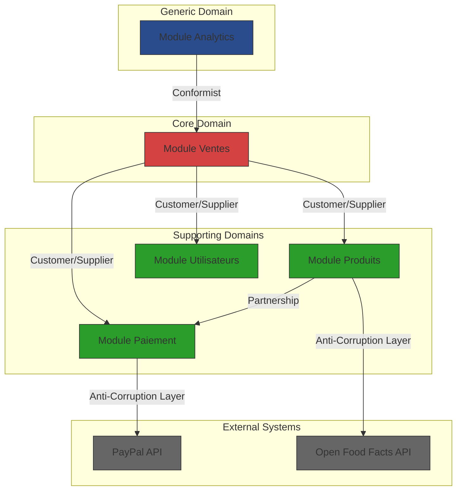
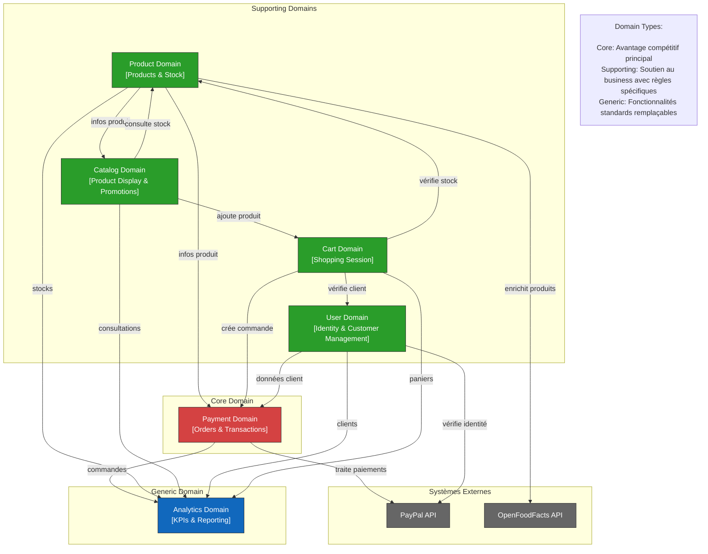

# Strategic Design

## Resources
- https://medium.com/nick-tune-tech-strategy-blog/domain-driven-architecture-diagrams-139a75acb578
- https://www.youtube.com/watch?v=Evers5npkmE&list=PLZBNtT95PIW3BPNYF5pYOi4MJjg_boXCG&index=2

## Analyse des domaines métiers (Bounded Contexts)

- **Gestion des Ventes**
    - Responsabilités :
        - Gestion du panier
        - Processus de paiement (PayPal)
        - Historique des achats
        - Génération des factures
- **Gestion des Paiements**
	- Responsabilités :
	    - Intégration avec PayPal
	    - Traitement des transactions
	    - Gestion des remboursements
	    - Sécurisation des données de paiement
	    - Suivi des statuts de paiement
	    - Réconciliation des paiements
	    - Anti-fraude
- **Gestion des Utilisateurs**
    - Responsabilités :
        - Gestion des comptes clients
        - Authentification et autorisation (JWT)
        - Gestion des informations personnelles et de facturation
- **Gestion des Produits**
    - Responsabilités :
        - Gestion du catalogue produits
        - Intégration avec Open Food Facts API
        - Gestion des stocks
        - Information nutritionnelle
- **Analyse et Reporting**
    - Responsabilités :
        - KPIs
        - Tableaux de bord
        - Visualisation des données
        - Génération de rapports

## Relations entre les Bounded Contexts (Context Map)

**Sales Module (Core Domain)**
- Pattern avec Products Module : `Customer/Supplier`
    - Le module Sales (`Customer`) dépend fortement des données produits (`Supplier`)
    - Cette relation est critique car elle impacte directement le processus de vente
    - **Contrat :** API interne pour la consultation des stocks et prix.
    - **Intégration :** Events RabbitMQ pour les mises à jour de stock.

- Pattern avec Payment Module : `Customer/Supplier`
    - Relation critique car le processus de vente dépend du succès du paiement
    - Contrat : Interface de paiement standardisée
    - Intégration : Communication synchrone via API interne

**Payment Module (Supporting Domain)**
- Pattern avec Products Module : `Anti-Corruption Layer`
    - Protection nécessaire pour l'intégration avec PayPal
    - **Contrat** : Transformation des modèles PayPal vers notre domaine
    - **Intégration** : API REST et Webhooks PayPal

**Analytics Module (Generic Domain)**
- Pattern avec Sales Module : `Conformist`
    - Relation unidirectionnelle où Analytics s'adapte aux données de vente
    - **Contrat** : Lecture seule des données de vente
    - **Intégration** : Events RabbitMQ pour les mises à jour

Les autres interactions entre modules peuvent simplement utiliser des mécanismes d'intégration standards sans nécessiter de pattern particulier, par exemple :

- **Le module Users** fournit des services d'authentification via API REST
- **Le module Products**  publie des événements de mise à jour de stock
- **Le module Payment** accède aux informations utilisateur via API simple

### Les types de domaines

Les domaines sont classifiés en trois catégories principales selon leur importance stratégique pour l'entreprise :

**1. Core Domain**
- C'est le cœur du business, ce qui différencie l'entreprise de ses concurrents
- Représente l'avantage compétitif de l'entreprise
- Nécessite le plus d'investissement en termes de ressources et d'expertise
- Doit être développé en interne
- Exemple dans notre cas : Le module Ventes car c'est le processus central de notre application de commerce

**2. Supporting Domain**
- Domaine nécessaire au fonctionnement du Core Domain
- Spécifique au business mais pas différenciant
- Peut être développé en interne ou sous-traité
- Important mais pas critique pour l'avantage compétitif
- Exemples dans notre cas :
    - Module Produits : gestion du catalogue et des stocks
    - Module Paiement : traitement des transactions
    - Module Utilisateurs : gestion des comptes clients

**3. Generic Domain**
- Fonctionnalités standard qui ne sont pas spécifiques au métier.
- Peut être trouvé dans de nombreuses applications différentes
- Peut être externalisé ou acheté comme solution
- N'apporte pas d'avantage compétitif
- Exemple dans notre cas : Module Analytics car c'est une fonctionnalité commune à beaucoup d'applications

Cette classification aide à :
- Prioriser les efforts de développement
- Identifier où investir le plus en termes de conception et de qualité
- Allouer les ressources efficacement
- (Décider quels composants peuvent être externalisés)

Dans notre architecture, cela se traduit par :
- Plus de ressources et d'attention sur le module Ventes (Core)
- Une implémentation solide mais standard pour les modules supports
- Une approche pragmatique et potentiellement externalisable pour l'analytics

### Diagramme de contexte v2

### Types de relations entre contextes (Strategic Patterns)

Les **Stategic Patterns** définissent comment les différents **Bounded Contexts** interagissent entre eux. 

Voici l'explication de chaque pattern mentionné :

**1. Customer/Supplier**
- Un contexte (`Customer`) dépend des données/services fournis par un autre contexte (`Supplier`)
- Le `Supplier` s'engage à fournir ce dont le `Customer` a besoin
- Le `Customer` peut négocier ses besoins avec le `Supplier`
- Exemple dans notre cas : Le module Sales (`Customer`) dépend du module products  (`Supplier`) pour les informations de stock

**2. Partnership**
- Deux contextes ont une dépendance mutuelle pour réussir
- Les équipes doivent coordonner leurs plannings et leurs développements
- Les deux contextes évoluent ensemble
- Exemple : Le module Products et le Module Payment collaborent étroitement pour la gestion des prix et promotions.

**3. Conformist**
- Un contexte downstream se conforme au modèle du contexte upstream
- Pas de négociation possible sur le modèle
- Le contexte downstream accepte d'utiliser le modèle tel quel
- Exemple : Le module Analytics s'adapte au modèle de données du module Sales 

**4. Anti-Corruption Layer (ACL)**
- Un pattern qui protège notre modèle de domaine contre des modèles externes qui pourraient le "corrompre"
- Agit comme une couche de traduction entre notre système et un système externe
- Isole notre logique métier des détails d'implémentation externes
- Traduit les données entre le format externe et notre modèle de domaine interne
- Exemple dans notre cas : Le module Payment utilise un ACL pour isoler notre logique métier des spécificités de l'API PayPal

## Event Storming
Un exercice pour créer les *domain models* lors de la phase de *strategic design*.

Plus simplement, c'est un atelier de *brain storming* avec les *domain experts* et l'équipes tech permettant de comprendre les événements d'un système.

<iframe width="560" height="315" src="https://www.youtube.com/embed/b6D_NTgzmhs?si=B0KL4kULZZ1qrBd0" title="YouTube video player" frameborder="0" allow="accelerometer; autoplay; clipboard-write; encrypted-media; gyroscope; picture-in-picture; web-share" referrerpolicy="strict-origin-when-cross-origin" allowfullscreen></iframe>

### Types d'events 
En DDD, on distingue principalement deux catégories d'events :
#### Domain Events
Les Domain Events représentent des occurrences importantes au sein d'un domaine métier en particulier. 

Ils sont restreint à un seul *bounded context* et sont vitaux pour préserver la logique métier.

Typiquement ils ont une *payload* plus légére et contiennent seulement l'information nécessaire au traitements. Cela s'explique par le fait que les *listeners* des *domain events* sont généralement dans le même service.
#### Integration Events
Les *Integration Events* servent à communiquer des changements à d'autres *bounded contexts*.

Ils assurent la consistence des données à travers le système.

Leur *payload* est généralement plus complexe avec des attributs supplémentaires car les besoins des différents *listeners* peuvent différer.

