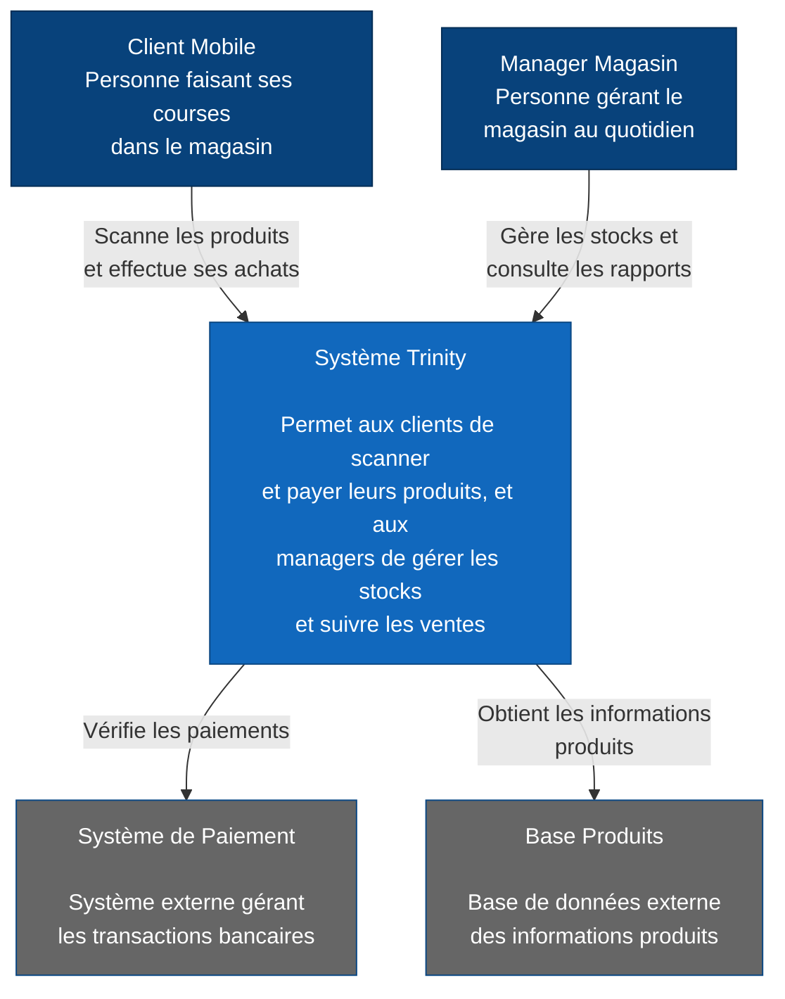
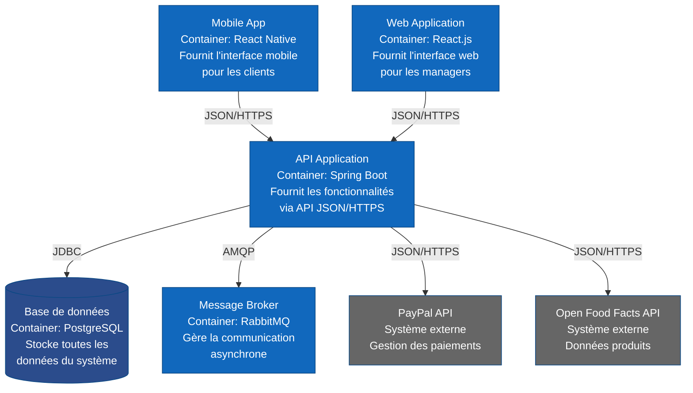
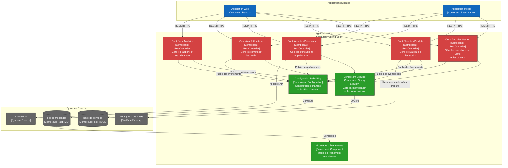

# Diagrammes C4

## Ressources
https://www.alexandrevandekerkhove.fr/2020/02/10/c4model-pour-les-diags-darchi.html
https://www.alexandrevandekerkhove.fr/2019/03/20/architecture-modulaire-microservices-on-en-est-ou.html

## C4
C4 est l’acronyme de **C**ontext, **C**ontainer, **C**omponent et **C**ode.

L’élément central du C4 model est l’approche en **différents niveaux de zoom** de la représentation du système à modéliser. Ces vues permettent d’avoir des détails précis ou au contraire une vue globale.

### Niveau 1 : Contexte

Le 1er niveau est un diagramme extrêmement simple, qui permet de visualiser le(s) application(s) à modéliser dans leur écosystème

### Niveau 2 : Conteneur

 Cette vue permet de visualiser les différentes briques logicielles qui composent le système modélisé.

 
Les technologies utilisées sont écrites, les interactions sont également plus précises en terme de protocole et format

Attention : Un conteneur est une unité d'exécution (un processus séparé) notre monolithe modulaire est donc représenté comme un seul conteneur.

### Niveau 3 : Composants
Le 3ème niveau, “composant”, décrit l’architecture locale d’une des briques logicielles. Le _conteneur_ (voir niveau 2) est découpé sous la forme de multiples composants. Chaque composant représente une fonctionnalité du conteneur.

