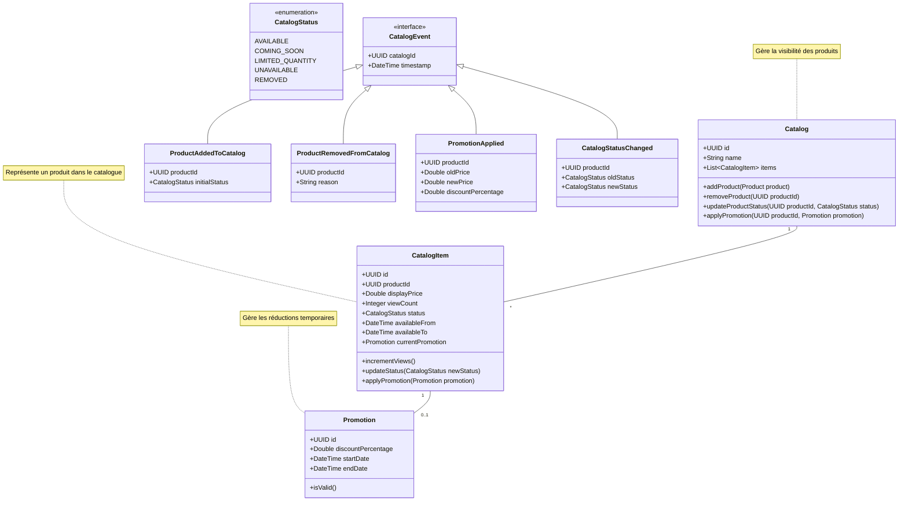

# Tactical Patterns

## Ressources
- https://en.wikipedia.org/wiki/Domain-driven_design

<iframe width="560" height="315" src="https://www.youtube.com/embed/WZb-FPmiuMY?si=-1tVU4gTm8Kk0t_M" title="YouTube video player" frameborder="0" allow="accelerometer; autoplay; clipboard-write; encrypted-media; gyroscope; picture-in-picture; web-share" referrerpolicy="strict-origin-when-cross-origin" allowfullscreen></iframe>

<iframe width="560" height="315" src="https://www.youtube.com/embed/3n3OcAIlXjk?si=-9qI3hd4XujJjA1f" title="YouTube video player" frameborder="0" allow="accelerometer; autoplay; clipboard-write; encrypted-media; gyroscope; picture-in-picture; web-share" referrerpolicy="strict-origin-when-cross-origin" allowfullscreen></iframe>

## Model Driven Design

Les développeurs construisent un *domain model* : un ensemble d'abstractions qui décrit une certains aspects du domaine métier et qui peut être utilisé pour résoudre des problèmes liés à ce domaine.

## Types de modèles

Une ***Entity*** est un objet qui n'est pas défini par ses attributs mais par son identité.

Example: Une companie d'avions assigne un numéro unique à chaque siège d'un avion; c'est l'identité du siège.

À contrario un ***value object*** est un objet immutable qui contient des attributs mais n'a pas d'identité propre.

Example: Une carte de visite contient des informations (attributs) mais on ne cherche pas à distinguer chaque carte de visite.

Les modèles peuvent aussi définir des ***events*** (quelque chose qui s'est produit dans le passé). Un ***domain event*** est un événement important pour les experts du domaine métier.

#### Aggregates
Les modèles peuvent être liés entre eux par une ***root entity*** (entité racine) et devenir des ***aggregates*** (aggrégats). 

Les objets externes peuvent conserver une référence à l'objet racine mais pas aux autres objets de l'aggrégat.

La racine de l'aggrégat conserve la consistence des changements dans l'aggrégat.

Example: Un conducteur ne contrôle pas individuellement chaque roue de son véhicule. Une voiture est un aggrégat de plusieurs objets (le moteur, les freins, les phares).

- https://www.baeldung.com/spring-persisting-ddd-aggregates

## Travailler avec les modèles
En DDD, la création d'un objet est souvent séparée de l'objet lui même.

Un ***repository*** par example est un objet avec des méthodes pour récupérer et stocker des *domain objects* (aggrégats) dans un *data store* (une *database*).

Une ***factory*** est un objet avec des méthodes qui créent directement des *domain objects* (aggrégats).

Quand une fonctionnalité d'un programme n'appartient conceptuellement à aucun objet du domaine métier elle est exprimée comme un ***service***.


## User Domain

L'organisation en packages pourrait ressembler à :


```
com.myapp.user/   
├── domain/           # Core Domain  
│   ├── User.java  
│   ├── Customer.java  
│   └── Employee.java  
├── infrastructure/   # Anti-Corruption Layer  
│   └── paypal/  
│       ├── PayPalIdentityAdapter.java  
│       └── PayPalIdentityTranslator.java  
└── application/      # Use Cases      
	└── UserService.java
```

### Core Domain


## Product Domain


### Stock sub-domain


## Catalog Domain

Nous avons décidé de considérer le Catalogue comme un domaine distinct plutôt qu'un sous-domaine de Produit. Voici pourquoi :

1. **Responsabilités distinctes** :
    - Le domaine Produit gère les informations intrinsèques des produits, les lots, les stocks
    - Le domaine Catalogue gère la présentation commerciale, les promotions, la visibilité
2. **Cycles de vie différents** :
    - Un produit peut exister sans être dans le catalogue
    - Les changements de catalogue (promotions, visibilité) n'impactent pas les données du produit
    - Les règles métier sont différentes (ex: gestion des stocks vs gestion des promotions)
3. **Équipes potentiellement différentes** :
    - Produit/Stock : équipe logistique
    - Catalogue : équipe marketing/commerciale

### Core Domain 



## Cart Domain
Le Panier (Cart) devrait être un domaine distinct plutôt qu'un sous-domaine du Payment car :
1. **Cycle de vie différent**
    - Le panier existe avant tout paiement
    - Le panier peut être annulé sans paiement
    - Un panier peut être sauvegardé/repris entre sessions
2. **Responsabilités spécifiques**
    - Gestion temporaire des produits sélectionnés
    - Calcul des totaux
    - Vérification des disponibilités
    - États transitoires avant paiement


## Payment Domain

### Core Domain


### Paypal Identity Anti-Corruption Layer


## Analytics Domain


### Key Performance Indicators

Description des KPIs choisis:

1. **SALES_REVENUE (Chiffre d'affaires)**
    - Calcul : Somme de tous les OrderStatus.VALIDATED sur la période
    - Source : Payment Domain (Orders)
    - Pertinence :
        - Mesure directe de la performance commerciale
        - Permet de suivre la croissance des ventes
        - Base pour le calcul d'autres métriques
2. **AVERAGE_BASKET (Panier moyen)**
    - Calcul : SALES_REVENUE / Nombre de commandes validées
    - Source : Payment Domain (Orders)
    - Pertinence :
        - Indicateur du comportement d'achat
        - Permet d'évaluer l'efficacité des promotions
        - Aide à la stratégie de pricing
3. **STOCK_TURNOVER (Rotation des stocks)**
    - Calcul : (Quantité vendue / Quantité moyenne en stock) sur la période
    - Sources :
        - Product Domain (Stock)
        - Payment Domain (OrderItems)
    - Pertinence :
        - Optimisation de la gestion des stocks
        - Identification des produits à fort/faible roulement
        - Aide à la prévision des réapprovisionnements
4. **TOP_PRODUCTS (Produits les plus vendus)**
    - Calcul : Classement des produits par quantité vendue
    - Sources :
        - Payment Domain (OrderItems)
        - Catalog Domain (consultations)
    - Pertinence :
        - Guide les décisions de réapprovisionnement
        - Aide au placement des produits dans le catalogue
        - Identification des tendances
5. **PROFIT_MARGIN (Marge bénéficiaire)**
    - Calcul : (SALES_REVENUE - Coût total des produits vendus) / SALES_REVENUE × 100
    - Sources :
        - Payment Domain (Orders)
        - Product Domain (coût des produits)
    - Pertinence :
        - Mesure de la rentabilité
        - Aide à la politique de prix
        - Évaluation de l'efficacité des promotions

Ces KPIs forment un ensemble cohérent pour :

- Suivre la performance commerciale (SALES_REVENUE, PROFIT_MARGIN)
- Optimiser les opérations (STOCK_TURNOVER)
- Comprendre le comportement client (AVERAGE_BASKET)
- Guider les décisions produit (TOP_PRODUCTS)

