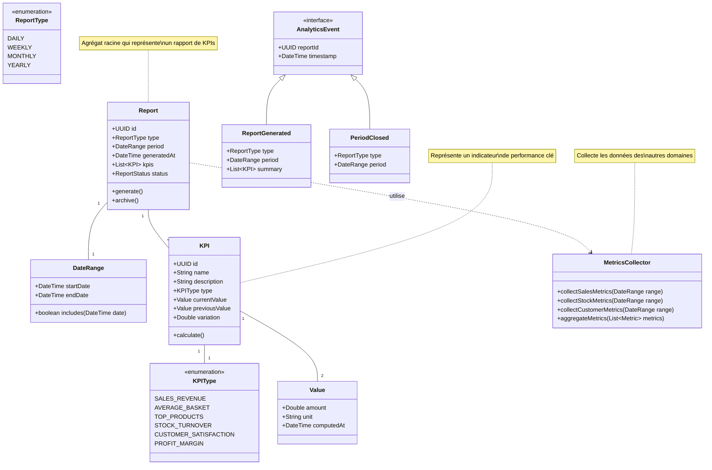

# Domaine Analytics

## Diagramme de classes (UML)

## Description du _Domain Model_

- Agrégat Racine : `Report`
  - Attributs principaux : id, type, period, generatedAt, kpis, status
  - Méthodes clés :
    - generate() : Génération du rapport
    - archive() : Archivage du rapport

- Value Objects :
  - `DateRange` : Période d'analyse
    - Attributs : startDate, endDate
    - Méthodes : includes()
  - `KPI` : Indicateur de performance
    - Attributs : id, name, description, type, currentValue, previousValue, variation
    - Méthodes : calculate()
  - `Value` : Valeur d'un KPI
    - Attributs : amount, unit, computedAt

- Énumérations :
  - `ReportType` : Types de rapports
    - DAILY : Rapport journalier
    - WEEKLY : Rapport hebdomadaire
    - MONTHLY : Rapport mensuel
    - YEARLY : Rapport annuel
  - `KPIType` : Types d'indicateurs
    - SALES_REVENUE : Chiffre d'affaires
    - AVERAGE_BASKET : Panier moyen
    - TOP_PRODUCTS : Produits les plus vendus
    - STOCK_TURNOVER : Rotation des stocks
    - CUSTOMER_SATISFACTION : Satisfaction client
    - PROFIT_MARGIN : Marge bénéficiaire

- Services :
  - `MetricsCollector` : Collecte des métriques
    - collectSalesMetrics() : Métriques des ventes
    - collectStockMetrics() : Métriques des stocks
    - collectCustomerMetrics() : Métriques clients
    - aggregateMetrics() : Agrégation des métriques

- Événements de Domaine :
  - `AnalyticsEvent` (interface) : Base pour les événements analytics
  - `ReportGenerated` : Génération d'un rapport
  - `PeriodClosed` : Clôture d'une période

- Règles Métier Principales :
  1. Les rapports doivent être générés à intervalles réguliers
  2. Chaque KPI doit inclure une variation par rapport à la période précédente
  3. Les données collectées doivent être horodatées
  4. Les métriques doivent être cohérentes entre les différents types de rapports
  5. Les rapports archivés doivent être immuables

- Interactions avec d'autres Domaines :
  1. Sales : Collecte des données de vente
  2. Product : Analyse des rotations de stock
  3. Customer : Suivi de la satisfaction client
  4. Payment : Analyse des transactions

## Key Performance Indicators

Description des KPIs choisis:

1. **SALES_REVENUE (Chiffre d'affaires)**
    - Calcul : Somme de tous les OrderStatus.VALIDATED sur la période
    - Source : Payment Domain (Orders)
    - Pertinence :
        - Mesure directe de la performance commerciale
        - Permet de suivre la croissance des ventes
        - Base pour le calcul d'autres métriques
2. **AVERAGE_BASKET (Panier moyen)**
    - Calcul : SALES_REVENUE / Nombre de commandes validées
    - Source : Payment Domain (Orders)
    - Pertinence :
        - Indicateur du comportement d'achat
        - Permet d'évaluer l'efficacité des promotions
        - Aide à la stratégie de pricing
3. **STOCK_TURNOVER (Rotation des stocks)**
    - Calcul : (Quantité vendue / Quantité moyenne en stock) sur la période
    - Sources :
        - Product Domain (Stock)
        - Payment Domain (OrderItems)
    - Pertinence :
        - Optimisation de la gestion des stocks
        - Identification des produits à fort/faible roulement
        - Aide à la prévision des réapprovisionnements
4. **TOP_PRODUCTS (Produits les plus vendus)**
    - Calcul : Classement des produits par quantité vendue
    - Sources :
        - Payment Domain (OrderItems)
        - Catalog Domain (consultations)
    - Pertinence :
        - Guide les décisions de réapprovisionnement
        - Aide au placement des produits dans le catalogue
        - Identification des tendances
5. **PROFIT_MARGIN (Marge bénéficiaire)**
    - Calcul : (SALES_REVENUE - Coût total des produits vendus) / SALES_REVENUE × 100
    - Sources :
        - Payment Domain (Orders)
        - Product Domain (coût des produits)
    - Pertinence :
        - Mesure de la rentabilité
        - Aide à la politique de prix
        - Évaluation de l'efficacité des promotions

Ces KPIs forment un ensemble cohérent pour :

- Suivre la performance commerciale (SALES_REVENUE, PROFIT_MARGIN)
- Optimiser les opérations (STOCK_TURNOVER)
- Comprendre le comportement client (AVERAGE_BASKET)
- Guider les décisions produit (TOP_PRODUCTS)

