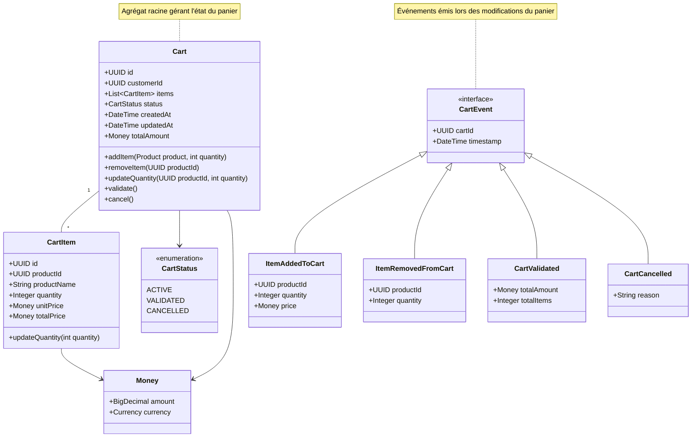

# Domaine Cart

## Diagramme de classes (UML) 

## Description du _Domain Model_

##### Justification de la Séparation
Le Panier est considéré comme un domaine distinct du domaine Payment pour les raisons suivantes :

1. **Cycle de vie différent** :
   - Existence indépendante du processus de paiement
   - Possibilité d'annulation sans paiement
   - Persistance possible entre les sessions utilisateur

2. **Responsabilités spécifiques** :
   - Gestion des produits sélectionnés
   - Calculs dynamiques des totaux
   - Vérification des disponibilités en temps réel
   - Gestion des états transitoires

##### Modèle de Domaine

- Agrégat Racine : `Cart`
  - Attributs principaux : id, customerId, items, status, createdAt, updatedAt, totalAmount
  - Méthodes clés :
    - addItem() : Ajout d'un produit au panier
    - removeItem() : Suppression d'un produit
    - updateQuantity() : Mise à jour des quantités
    - validate() : Validation du panier
    - cancel() : Annulation du panier

- Value Objects :
  - `CartItem` : Élément du panier
    - Attributs : id, productId, productName, quantity, unitPrice, totalPrice
    - Méthodes : updateQuantity()
  - `Money` : Représentation des montants
    - Attributs : amount, currency

- Énumérations :
  - `CartStatus` : États possibles du panier
    - ACTIVE : Panier en cours d'utilisation
    - VALIDATED : Panier validé pour paiement
    - CANCELLED : Panier annulé

- Événements de Domaine :
  - `CartEvent` (interface) : Base pour tous les événements panier
  - `ItemAddedToCart` : Ajout d'un article
  - `ItemRemovedFromCart` : Retrait d'un article
  - `CartValidated` : Validation du panier
  - `CartCancelled` : Annulation du panier

- Règles Métier Principales :
  1. Un panier doit appartenir à un client identifié
  2. Les prix des articles sont figés au moment de l'ajout
  3. Les quantités doivent être positives et disponibles
  4. Le total du panier doit être recalculé à chaque modification
  5. Un panier validé ne peut plus être modifié
  6. Un panier peut être annulé à tout moment avant paiement

- Interactions avec d'autres Domaines :
  1. Product : Vérification des disponibilités
  2. Catalog : Récupération des prix en vigueur
  3. Payment : Transmission du panier validé
  4. User : Association au client