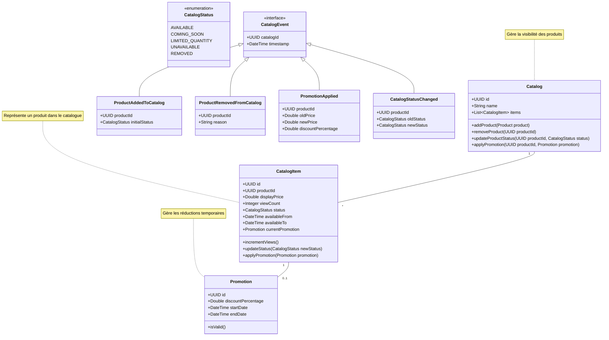

## Diagramme de classes (UML)

Nous avons décidé de considérer le Catalogue comme un domaine distinct plutôt qu'un sous-domaine de Produit. Voici pourquoi :

1. **Responsabilités distinctes** :
    - Le domaine Produit gère les informations intrinsèques des produits, les lots, les stocks
    - Le domaine Catalogue gère la présentation commerciale, les promotions, la visibilité
2. **Cycles de vie différents** :
    - Un produit peut exister sans être dans le catalogue
    - Les changements de catalogue (promotions, visibilité) n'impactent pas les données du produit
    - Les règles métier sont différentes (ex: gestion des stocks vs gestion des promotions)
3. **Équipes potentiellement différentes** :
    - Produit/Stock : équipe logistique
    - Catalogue : équipe marketing/commerciale

### Core Domain 

## Description du _Domain Model_

#### Domain Catalog
- Agrégat Racine : `Catalog`
  - Attributs : id, name, items
  - Méthodes principales : 
    - addProduct() : Ajout d'un produit au catalogue
    - removeProduct() : Retrait d'un produit
    - updateProductStatus() : Mise à jour du statut
    - applyPromotion() : Application d'une promotion

- Value Objects :
  - `CatalogItem` : Représentation d'un produit dans le catalogue
    - Attributs : id, productId, displayPrice, viewCount, status, availableFrom, availableTo
    - Méthodes : incrementViews(), updateStatus(), applyPromotion()
  - `Promotion` : Gestion des réductions
    - Attributs : id, discountPercentage, startDate, endDate
    - Méthodes : isValid()

- Énumérations :
  - `CatalogStatus` : États possibles d'un produit dans le catalogue
    - AVAILABLE : Disponible à la vente
    - COMING_SOON : Prochainement disponible
    - LIMITED_QUANTITY : Quantité limitée
    - UNAVAILABLE : Indisponible
    - REMOVED : Retiré du catalogue

- Événements de Domaine :
  - `CatalogEvent` (interface) : Base pour tous les événements catalogue
  - `ProductAddedToCatalog` : Ajout d'un produit
  - `ProductRemovedFromCatalog` : Retrait d'un produit
  - `PromotionApplied` : Application d'une promotion
  - `CatalogStatusChanged` : Changement de statut

- Règles Métier Principales :
  1. Un produit peut avoir un seul statut à la fois
  2. Une promotion doit avoir une date de début et de fin valides
  3. Le prix affiché doit tenir compte des promotions en cours
  4. Les changements de statut doivent être tracés
  5. Les vues des produits doivent être comptabilisées

- Interactions avec d'autres Domaines :
  1. Product : Référencement des produits via leur ID
  2. Sales : Vérification de la disponibilité et du prix
  3. Analytics : Suivi des vues et performances des promotions