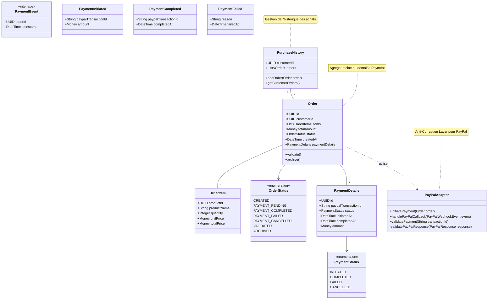

# Domaine Payment

## Diagramme de classes (UML)

### Core Domain (Payment)

## Description du _Domain Model_
- Agrégat Racine : `Order`
  - Attributs clés : id, customerId, items, totalAmount, status, createdAt, paymentDetails
  - Méthodes principales : validate(), archive()
  - Énumérations associées : OrderStatus (CREATED, PAYMENT_PENDING, PAYMENT_COMPLETED, etc.)

- Objets-Valeurs :
  - `OrderItem` : Représente un item dans la commande (productId, productName, quantity, unitPrice, totalPrice)
  - `PaymentDetails` : Détails du paiement (id, paypalTransactionId, status, initiatedAt, completedAt, amount)
  - `Money` : Représentation des montants monétaires

- Événements de Domaine :
  - `PaymentEvent` (interface)
  - `PaymentInitiated` : Déclenché lors de l'initiation du paiement
  - `PaymentCompleted` : Déclenché lors de la completion du paiement
  - `PaymentFailed` : Déclenché en cas d'échec du paiement

- Entités Associées :
  - `PurchaseHistory` : Gestion de l'historique des achats par client
    - Méthodes : addOrder(), getCustomerOrders()

- Règles Métier Principales :
  1. Une commande doit être validée avant le processus de paiement
  2. Le statut de paiement doit suivre une progression logique (INITIATED -> COMPLETED/FAILED)
  3. Les détails de paiement doivent être conservés pour audit
  4. L'historique des achats doit être maintenu par client

#### Domaine Catalog
- Agrégat Racine : `Catalog`
- Objets-Valeurs : `CatalogItem`, `Promotion`
- Événements de Domaine : `ProductAddedToCatalog`, `ProductRemovedFromCatalog`, `PromotionApplied`

### Mises à jour de la Documentation
- Ajout des guides d'implémentation par contexte borné
- Documentation des invariants d'agrégats et règles métier
- Création des spécifications techniques pour les objets-valeurs
- Ajout des patterns d'intégration entre domaines
