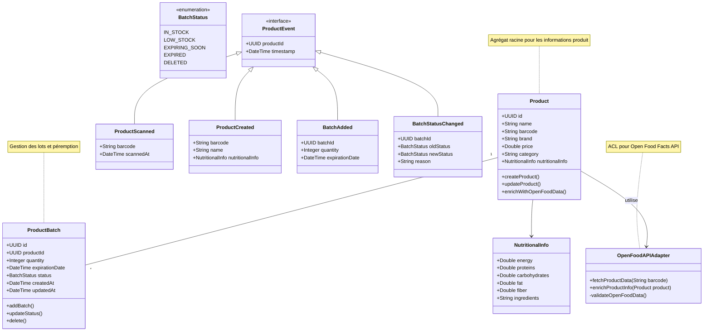
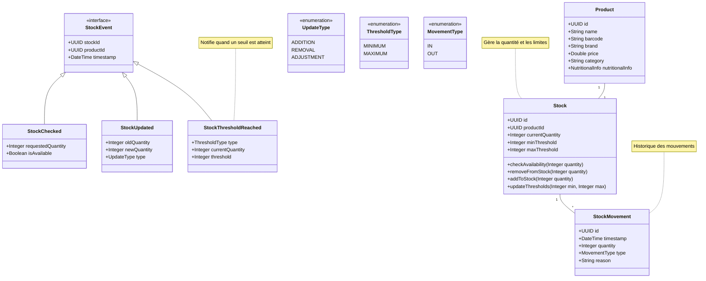

# Domaine Product

## Diagramme de classes (UML)

### Core Domain (Product) 

### Sub-domain (Stock)

## Description du _Domain Model_

- Agrégat Racine : `Product`
  - Attributs principaux : id, name, barcode, brand, price, category, nutritionalInfo
  - Méthodes clés : createProduct(), updateProduct(), enrichWithOpenFoodData()
  - Gestion des lots via `ProductBatch`

- Value Objects :
  - `NutritionalInfo` : Informations nutritionnelles
    - Attributs : energy, proteins, carbohydrates, fat, fiber, ingredients
  - `ProductBatch` : Gestion des lots
    - Attributs : id, productId, quantity, expirationDate, status, createdAt, updatedAt
    - Méthodes : addBatch(), updateStatus(), delete()

- Énumérations :
  - `BatchStatus` : États des lots
    - IN_STOCK : Disponible en stock
    - LOW_STOCK : Stock faible
    - EXPIRING_SOON : Proche de la péremption
    - EXPIRED : Périmé
    - DELETED : Supprimé

- Événements de Domaine :
  - `ProductEvent` (interface) : Base pour tous les événements produit
  - `ProductScanned` : Scan d'un produit (barcode, scannedAt)
  - `ProductCreated` : Création d'un nouveau produit
  - `BatchAdded` : Ajout d'un nouveau lot
  - `BatchStatusChanged` : Changement de statut d'un lot

- Anti-Corruption Layer :
  - `OpenFoodAPIAdapter` : Interface avec l'API Open Food Facts
    - Méthodes : fetchProductData(), enrichProductInfo()
    - Validation des données externes

- Règles Métier Principales :
  1. Chaque produit doit avoir un code-barres unique
  2. Les informations nutritionnelles sont enrichies via Open Food Facts
  3. La gestion des lots doit tenir compte des dates de péremption
  4. Les changements de statut des lots doivent être tracés
  5. Les produits périmés ne doivent pas être disponibles à la vente

- Comportements Spécifiques :
  - Enrichissement automatique des données via Open Food Facts
  - Surveillance des dates de péremption
  - Gestion des alertes de stock faible
  - Traçabilité des mouvements de stock
