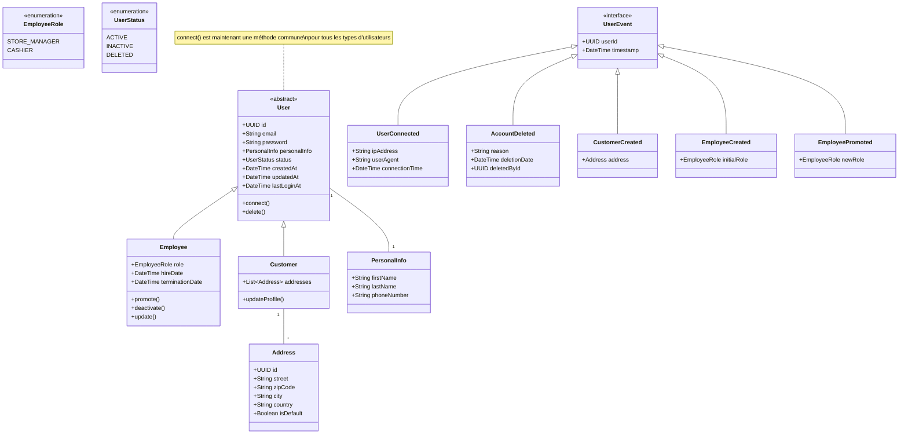
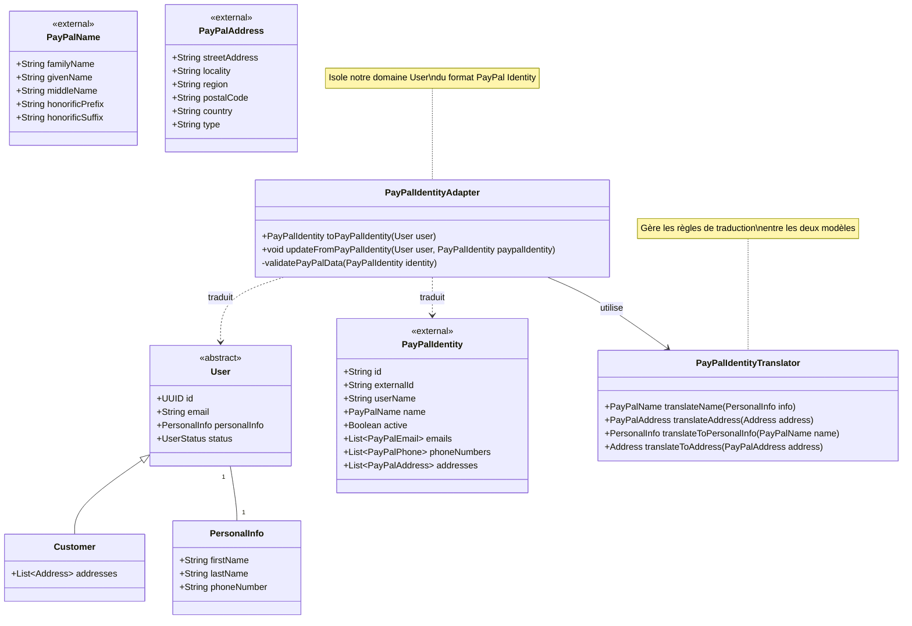

# User Domain Model

## Diagramme de classes (UML)


### Anti-Corruption Layer (Paypal Identity)




## Description du _Domain Model_

- Agrégat Racine : `User` (classe abstraite)
  - Attributs de base : id, email, password, personalInfo, status, createdAt, updatedAt, lastLoginAt
  - Méthodes communes : connect(), delete()
  - Types d'utilisateurs :
    - `Employee` : Utilisateur interne avec rôle et dates d'emploi
    - `Customer` : Client avec gestion d'adresses

- Value Objects :
  - `PersonalInfo` : Informations personnelles (firstName, lastName, phoneNumber)
  - `Address` : Adresse postale (street, zipCode, city, country, isDefault)

- Énumérations :
  - `EmployeeRole` : Définit les rôles des employés (STORE_MANAGER, CASHIER)
  - `UserStatus` : États possibles d'un utilisateur (ACTIVE, INACTIVE, DELETED)

- Anti-Corruption Layer :
  - `PayPalAdapter` : Gère l'intégration avec PayPal
    - Méthodes : initiatePayment(), handlePayPalCallback(), validatePayment()
  - `PayPalIdentityAdapter` : Gère la traduction des identités utilisateurs
    - Méthodes : toPayPalIdentity(), updateFromPayPalIdentity()
  - `PayPalIdentityTranslator` : Traduit les données d'identité entre notre domaine et PayPal

- Événements de Domaine :
  - `UserEvent` (interface) : Base pour tous les événements utilisateur
  - `UserConnected` : Trace les connexions (ipAddress, userAgent, connectionTime)
  - `AccountDeleted` : Suivi des suppressions de compte (reason, deletionDate, deletedById)
  - `CustomerCreated` : Création d'un nouveau client
  - `EmployeeCreated` : Création d'un nouvel employé (initialRole)
  - `EmployeePromoted` : Promotion d'un employé (newRole)

- Règles Métier Principales :
  1. Un utilisateur doit avoir une adresse email unique
  2. Les mots de passe doivent être stockés de manière sécurisée
  3. Les employés doivent avoir un rôle défini
  4. Un client peut avoir plusieurs adresses mais une seule par défaut
  5. La traçabilité des connexions et modifications doit être maintenue
  6. La suppression d'un compte doit être tracée avec la raison et l'auteur

- Comportements Spécifiques :
  - Employee :
    - `promote()` : Gestion des promotions
    - `deactivate()` : Désactivation d'un compte employé
    - `update()` : Mise à jour des informations employé
  - Customer :
    - `updateProfile()` : Mise à jour du profil client

## Organisation du package Java
L'organisation en packages pourrait ressembler à :


```
com.myapp.user/   
├── domain/           # Core Domain  
│   ├── User.java  
│   ├── Customer.java  
│   └── Employee.java  
├── infrastructure/   # Anti-Corruption Layer  
│   └── paypal/  
│       ├── PayPalIdentityAdapter.java  
│       └── PayPalIdentityTranslator.java  
└── application/      # Use Cases      
	└── UserService.java
```

